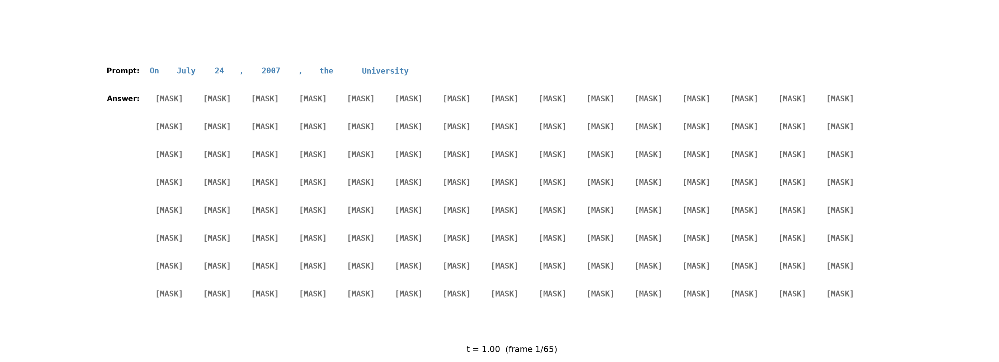

<div align="center">

# HALE-LLM

Compare **autoregressive**, **masked diffusion**, **block diffusion**, and **flow matching** on one transformer backbone.

</div>

<p align="center">
  
</p>

<p align="center">
  <em>Block diffusion at step 4900: prompt in steelblue, committed tokens in orange, the active block in black on a light overlay.</em>
</p>

<p align="center">
  
  
  
  
</p>

---

## Why this repo

The decoder is a small library: **components** (attention, FFN, layers), **transformer stacks** that run on hidden states `(B, S, D)` for a VLM or world model, and **token backbones** that map ids → logits. Masking, attention, FFN, and `arch` are config switches. Train, sample, eval, and visualize through one CLI. Details: [docs/core.md](docs/core.md).

| Switch | Options |
|---|---|
| Variant | `autoregressive` · `diffusion` · `block_diffusion` · `flow_matching` · `mtp` (stub) |
| Attention mask | `causal` · `bidirectional` · `block_causal` |
| Attention impl | `mha` · `gqa` · `mqa` |
| Backbone | `transformer` (GPT-style) · `lgt` (local/global + dual RoPE) · `dit` (AdaLN-Zero) |
| FFN | `mlp` · `geglu` · DeepSeek-style `moe` |
| Token loss | `ce` · `focal` |

Shared core (`core/`, `dataloader/`, `training/`, `inference/`, `metrics/`) never imports a `models_*` package by name. Each paradigm lives in `src/ha_llm/models/models_<name>/` and registers with `@register_model` / `@register_loss` / `@register_sampler` / `@register_metric`.

---

## Quick start

```bash
uv sync
uv sync --extra dev
uv run pytest tests/unit -q
```

Train block diffusion on full WikiText-2 (MPS / CUDA via `device` in YAML):

```bash
uv run ha-llm-train --config configs/block_diffusion/small.yaml --no-resume --viz
```

Sample, eval, and write a GIF from `latest` or a named run:

```bash
uv run ha-llm-sample --config configs/block_diffusion/small.yaml
uv run ha-llm-eval --config configs/block_diffusion/small.yaml
uv run ha-llm-viz --config configs/block_diffusion/small.yaml
tensorboard --logdir data/experiments
```

---

## Variants

| Config | What it does |
|---|---|
| [`configs/autoregressive/small.yaml`](configs/autoregressive/small.yaml) | Next-token LM (reference) |
| [`configs/diffusion/small.yaml`](configs/diffusion/small.yaml) | Absorbing-state masked diffusion |
| [`configs/block_diffusion/small.yaml`](configs/block_diffusion/small.yaml) | AR across blocks, diffusion inside the block |
| [`configs/flow_matching/small.yaml`](configs/flow_matching/small.yaml) | Discrete flow matching |
| [`configs/mtp/small.yaml`](configs/mtp/small.yaml) | Multi-token heads (stub) |

Default small model: `d_model=384`, 16 layers, 8 heads, `d_ff=1536`, `max_length=128`, GPT-2 tokenizer, WikiText-2 with a **10-word sliding stride**. Diffusion, block diffusion, and flow matching use **LGT** (`arch: lgt`, local-global transformer). Autoregressive stays on `transformer`.

---

## Experiments

Each run is namespaced:

```
data/experiments/<variant>/<variant>_<YYYYMMDD_HHMMSS>/
  config.yaml          # resolved settings
  configs/             # source YAML chain
  checkpoints/last.pt
  logs/train.log
  tb/                  # TensorBoard
  viz/                 # generation GIFs
```

`latest` is a symlink to the newest folder. Resume with `--resume` (uses `latest`) or `--experiment NAME`.

Training GIFs write every `viz.every_n_steps` (default 50) using a short sampler. Prompts are taken from WikiText validation (`viz.prompt_source: dataset`). Override with `--prompt`.

---

## Configuration

YAML files under `configs/` are the source of truth. [`configs/base.yaml`](configs/base.yaml) holds shared size, data, and logging. Each variant file sets `inherits: ../base.yaml` and overrides only what that paradigm needs (`variant`, attention mask, `arch`, `block_size`).

Unknown keys are rejected. After a run, the merged file is saved as `data/experiments/<variant>/<run>/config.yaml`.

**High-level map**

| Section | Role |
|---|---|
| `variant` | Which model/loss/sampler (`autoregressive`, `diffusion`, `block_diffusion`, `flow_matching`, `mtp`) |
| `model` | Width/depth, `arch` (`transformer` \| `lgt` \| `dit`), mask (`causal` \| `bidirectional` \| `block_causal`), FFN, time cond |
| `train` | `epochs` or `steps`, `batch_size`, `lr`, `loss_type`, resume |
| `data` | Hugging Face dataset (`Salesforce/wikitext` + `subset`) or `overfit_text`; `train_size: null` means the **full** split |
| `sample` / `eval` / `viz` | Generation length, metrics, GIF cadence |
| `device` | `mps`, `cuda`, or `cpu` |

**Typical edits**

```yaml
# WikiText-2, full split (null = no row cap)
data:
  dataset: Salesforce/wikitext
  subset: wikitext-2-raw-v1
  train_size: null

# Swap LGT for DiT on a denoiser
model:
  arch: dit

# Faster laptop run
train:
  batch_size: 8
  epochs: 2
data:
  train_size: 512
```

Every key, type, default, and recipe: **[docs/config.md](docs/config.md)**.

---

## Adding a paradigm

1. New folder `src/ha_llm/models/models_<name>/` with model, loss, sampler (and optional metric).
2. One import in `src/ha_llm/models/__init__.py`.
3. One YAML under `configs/<name>/`.

Public facades stay the same: `train()`, `evaluate()`, `load_session()`.

---

## Tests

```bash
uv run pytest tests/unit -q
uv run pytest tests/integration/test_overfit_sanity.py -k autoregressive -v
```
